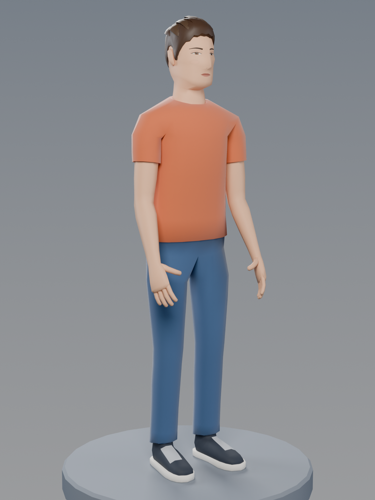
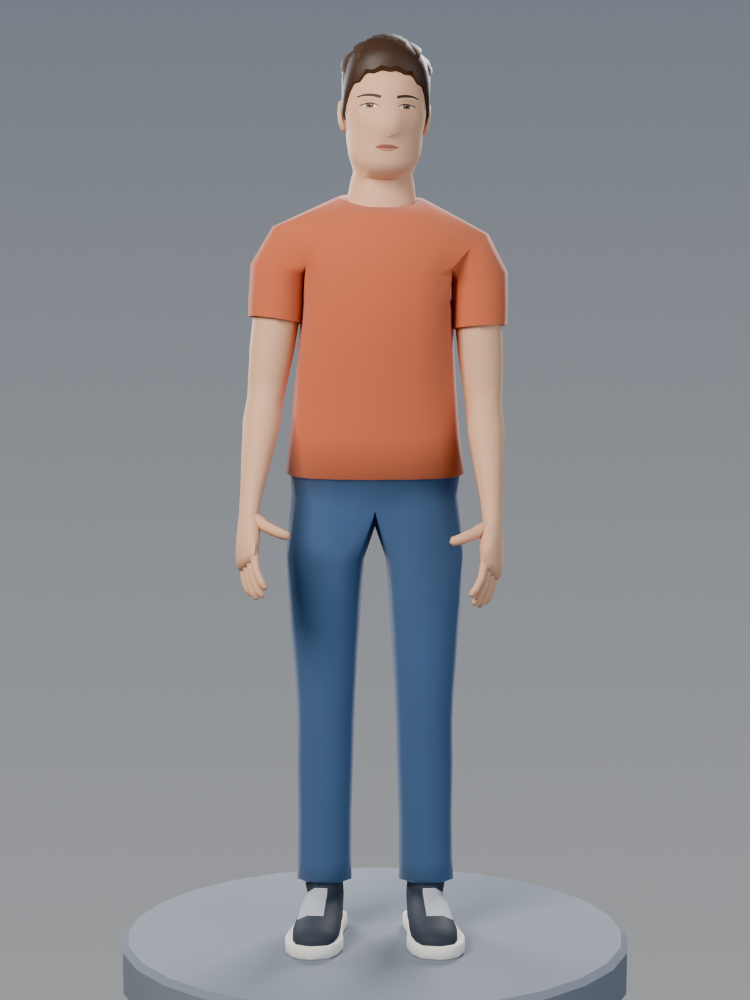
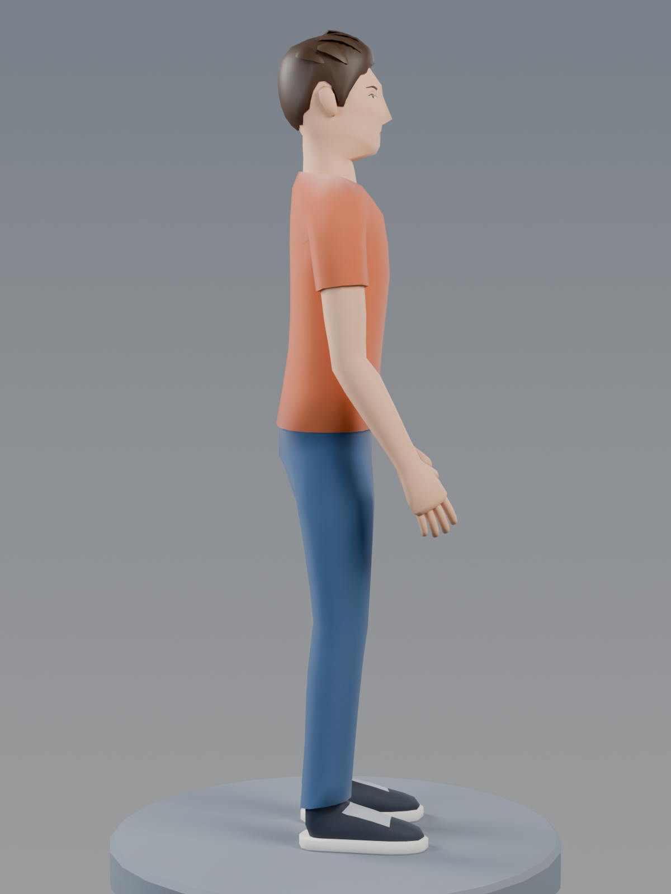
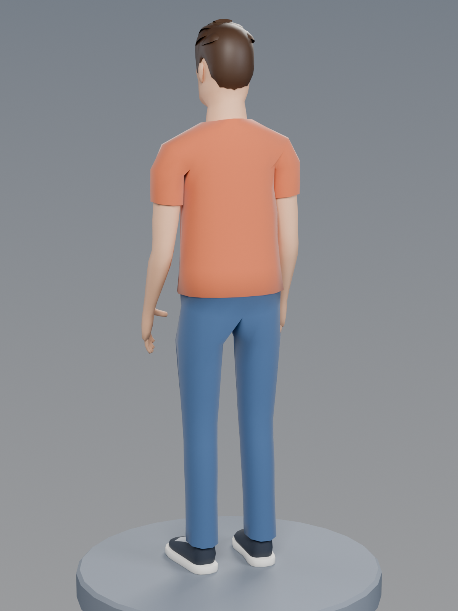
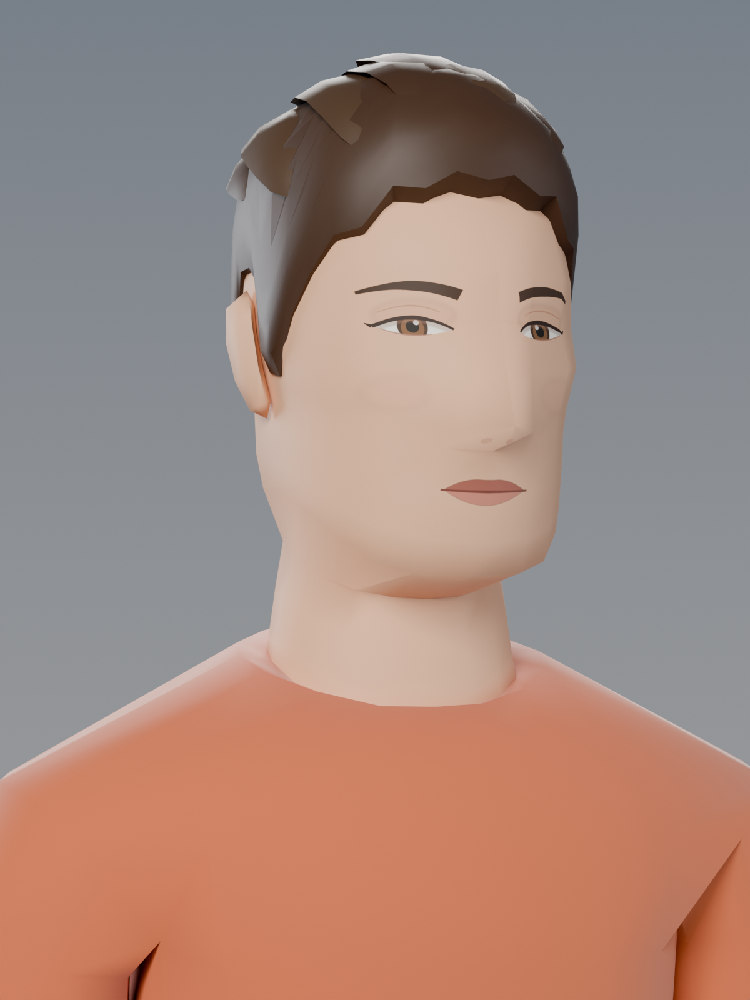
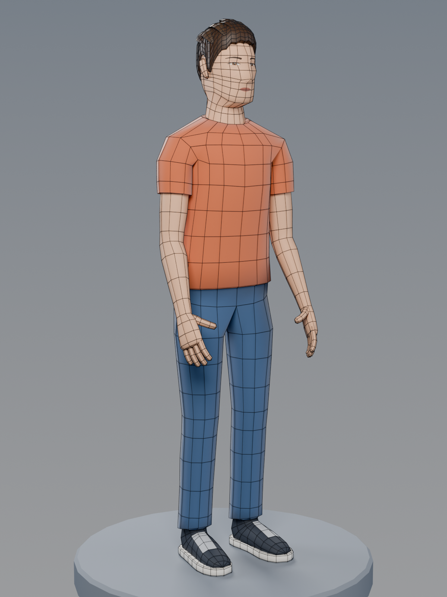
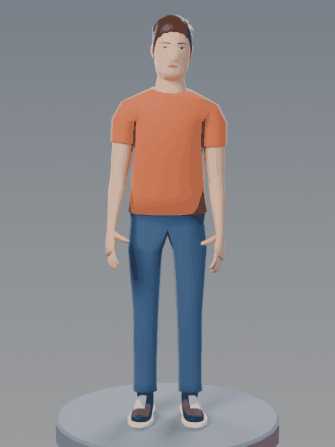

# Lowpoly

Procedural low-poly characters for Blender. Each model is generated entirely by a Python script
using `bpy`, so it can be tweaked and rebuilt from code.

- [Low-poly human](#low-poly-human): `human_lowpoly.py`
- [Low-poly Rudeus Greyrat](#low-poly-rudeus-greyrat): `rudeus_lowpoly.py`

---

## Low-poly human

A stylised adult in a T-shirt, jeans and sneakers. It has about 4.5k triangles, smooth shading,
a painted face texture and a full armature, so you can pose or animate it.



| Front | Side | Back | Portrait |
|---|---|---|---|
|  |  |  |  |

| Topology | Turntable |
|---|---|
|  |  |

### Why it doesn't look blocky

- **No boxes.** The body is lofted through rounded cross-sections (superellipses) placed at
  anatomical landmarks: chest, waist, hips, glutes, knees, calves, deltoids, forearms, jaw,
  cheekbones and brow. Smooth shading hides the facets, and edges stay sharp only at real creases
  such as the hems, collar and sole.
- **One continuous mesh.** Torso, neck, head, arms, hands, legs and shoe uppers form a single
  watertight surface. The arms grow out of a shoulder socket in the torso, and the legs split at a
  proper crotch loop, so no parts are stuck on or intersecting. The fingers, ears and rubber soles
  are small separate shells inside the same object.
- **Clean quad topology.** The edge loops follow the body and sit where the joints bend, so the
  mesh deforms smoothly when posed (see the wireframe render).

### Files

| File | What it is |
|---|---|
| `models/human_lowpoly.blend` | Full Blender scene: rigged character in a relaxed pose, pedestal, lights, camera (texture packed) |
| `models/human_lowpoly.glb` | Rigged character (mesh, skin and armature in the A-pose rest) for game engines, three.js and web viewers |
| `models/human_lowpoly.fbx` | Rigged character for Unity, Unreal and other tools (texture embedded) |
| `models/human_lowpoly.obj` / `.mtl` | Static mesh in the relaxed pose from the renders |
| `models/textures/human_face.png` | Face texture (eyes, brows, lips) |
| `human_lowpoly.py` | The procedural build script that generates everything above |

### What's in the model

The character is made of three objects:

- **Human_Body**: the skin and clothes. Materials are `Skin`, `Skin_Face` (front-projected face
  texture), `Shirt`, `Jeans`, `Shoe`, `Sole` and `Lace`. The T-shirt hem, sleeve hems, crew neck
  and jeans cuffs are modelled as small steps in the surface, so they catch the light like real
  fabric edges.
- **Human_Hair**: a short cut shrink-wrapped onto the scalp, with a choppy hairline that goes around
  the ears into sideburns and a few chunky locks on top.
- **Human_Rig**: a 52-bone armature with `.L`/`.R` names that Blender can mirror: root, hips, spine,
  chest, neck, head, clavicles, arms, hands, three-bone fingers and thumbs, thighs, shins, feet
  and toes. The skin weights come from Blender's heat weighting, are smoothed so the shoulders and
  hips fold softly, and are limited to 4 influences per vertex for game engines. The hair is
  weighted to the head.

Units are metres, Z is up and the character faces −Y. The origin is at the feet, and the character
is about 1.8 m tall to the top of the hair. The rest pose is an A-pose with the arms 52° below horizontal;
the `.blend` opens in the relaxed pose used for the renders.

### Rebuilding / tweaking

Everything is generated by `human_lowpoly.py`. Here is where to edit:

- **Colours**: the `PALETTE` dict.
- **Body shape**: the torso cross-sections in `TORSO_SPEC`, the head in `HEAD_SPEC` /
  `FACE_PROFILE_Y` / `FACE_TWEAKS`, the legs in `leg_specs` and the arms in `build_arm()`.
- **Joints and A-pose angle**: `S_JOINT`, `H_JOINT`, `K_JOINT`, `ARM_DROP`, …
- **Head size and eye size**: `HEAD_SCALE` and `EYE_K`.
- **Haircut**: `HAIRLINE`, `hair_thickness()` and the locks list in `build_hair()`.
- **Render pose**: `relaxed_pose()`.

```bash
# with Blender installed
blender -b -P human_lowpoly.py -- --render --turntable

# or with the standalone bpy module (Python 3.11)
pip install bpy pillow
python3 human_lowpoly.py --render --turntable
```

Flags: `--render` writes the preview stills, `--turntable` writes the GIF, `--quick` renders at
low resolution and low sample counts for fast iteration, `--views front,portrait` renders only
those views, `--out DIR` writes the output somewhere else, and `--flat` switches to flat-shaded
facets if you prefer the faceted low-poly look.

---

## Low-poly Rudeus Greyrat

A stylised, low-poly **Rudeus Greyrat** (*Mushoku Tensei*) for Blender: teenage Rudeus in his grey
hooded mage robe, holding his staff **Aqua Heartia**. About 6.3k triangles with flat-shaded
facets and a hand-painted anime face texture.


| Front | Side | Back | Portrait |
|---|---|---|---|
|  |  |  |  |


### Files

| File | What it is |
|---|---|
| `models/rudeus_lowpoly.blend` | Full Blender scene: character, staff, pedestal, lights, camera (texture packed) |
| `models/rudeus_lowpoly.glb` | Character + staff for game engines, three.js and other web viewers (texture embedded) |
| `models/rudeus_lowpoly.fbx` | Character + staff for Unity, Unreal and other tools (texture embedded) |
| `models/rudeus_lowpoly.obj` / `.mtl` | Character + staff as plain OBJ |
| `models/textures/rudeus_face.png` | Face texture (eyes, brows, mouth, blush) |
| `rudeus_lowpoly.py` | The procedural build script that generates everything above |
| `renders/` | Preview renders (Cycles) |

### What's in the model

The character is split into four objects parented to the `Rudeus_Greyrat` empty:

- **Rudeus_Body**: head with the front-projected anime face texture (green eyes), neck, ears and hands
- **Rudeus_Hair**: chestnut-brown clumps that fan out from the crown whorl into spiky ends, with bangs falling between the eyes
- **Rudeus_Clothes**: long open-front grey robe with dark lining and trim, lowered hood, wide cuffed
  sleeves, cream button-up shirt with a stand collar, belt with a gold buckle, dark trousers and
  leather boots with turned-down cuffs
- **Aqua_Heartia**: wooden staff with gold collars, a leather grip and three twisting branches that hold a
  glowing aqua magic stone

Units are metres, Z is up and the character faces −Y. The origin is at his feet, and he is about
1.6 m tall.

### Rebuilding / tweaking

Everything is generated by `rudeus_lowpoly.py`. To change colours, edit the `PALETTE` dict. To change
proportions, edit `R` / `HC` (head) and the joint positions (`L_SHOULDER`, `R_ELBOW`, …). Hair
clumps are listed in `build_hair()`.

```bash
# with Blender installed
blender -b -P rudeus_lowpoly.py -- --render --turntable

# or with the standalone bpy module (Python 3.11)
pip install bpy pillow
python3 rudeus_lowpoly.py --render --turntable
```

Flags: `--render` writes the preview stills, `--turntable` writes the GIF, `--quick` renders at
low resolution and low sample counts for fast iteration, `--views front,portrait` renders only
those views, and `--out DIR` writes the output somewhere else.

Fan art: Rudeus Greyrat and *Mushoku Tensei* belong to Rifujin na Magonote and their respective
rights holders.
