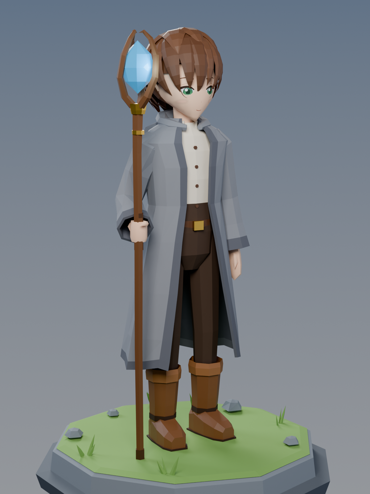
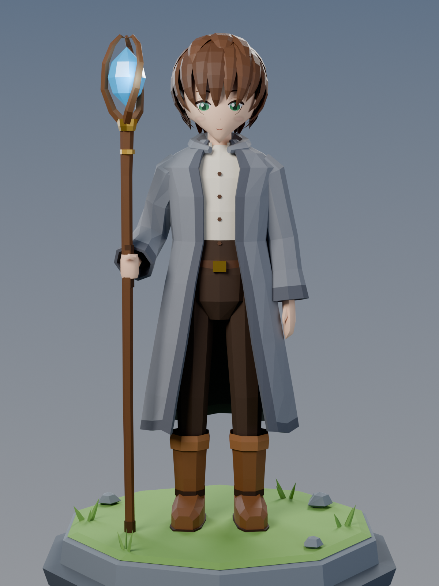
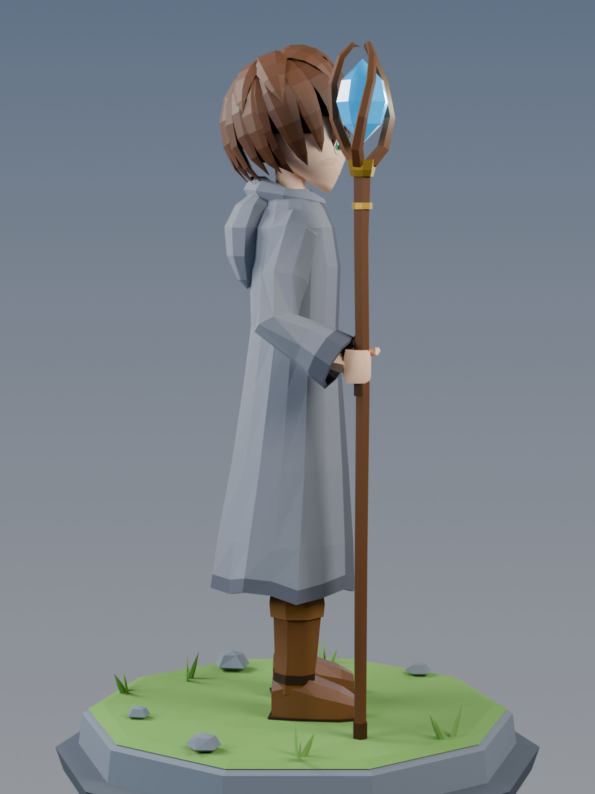
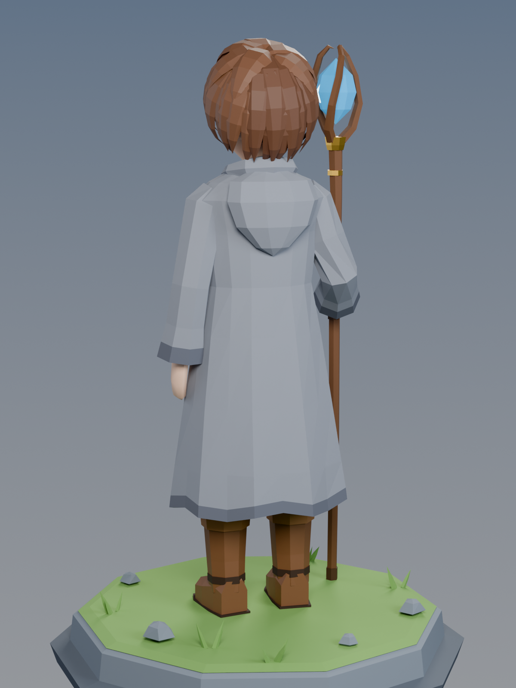
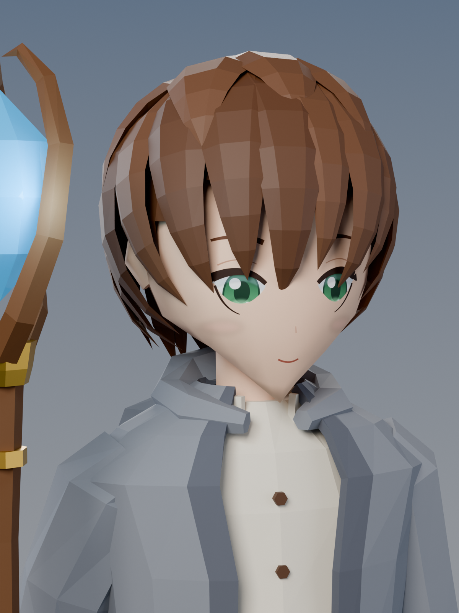
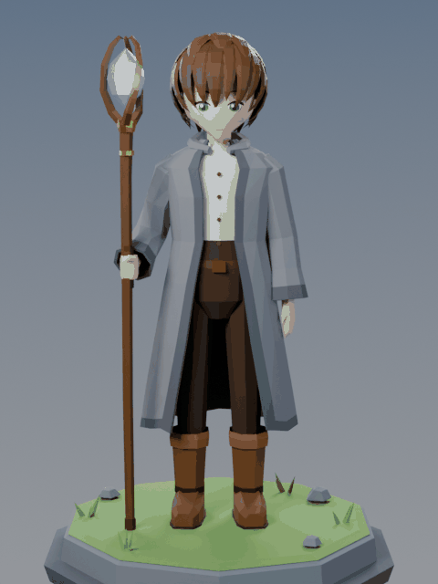

# Low-poly Rudeus Greyrat

A stylised, low-poly **Rudeus Greyrat** (*Mushoku Tensei*) for Blender: teenage Rudeus in his grey
hooded mage robe, holding his staff **Aqua Heartia**. About 6.3k triangles with flat-shaded
facets and a hand-painted anime face texture.



| Front | Side | Back | Portrait |
|---|---|---|---|
|  |  |  |  |



## Files

| File | What it is |
|---|---|
| `models/rudeus_lowpoly.blend` | Full Blender scene: character, staff, pedestal, lights, camera (texture packed) |
| `models/rudeus_lowpoly.glb` | Character + staff for game engines, three.js and other web viewers (texture embedded) |
| `models/rudeus_lowpoly.fbx` | Character + staff for Unity, Unreal and other tools (texture embedded) |
| `models/rudeus_lowpoly.obj` / `.mtl` | Character + staff as plain OBJ |
| `models/textures/rudeus_face.png` | Face texture (eyes, brows, mouth, blush) |
| `rudeus_lowpoly.py` | The procedural build script that generates everything above |
| `renders/` | Preview renders (Cycles) |

## What's in the model

The character is split into four objects parented to the `Rudeus_Greyrat` empty:

- **Rudeus_Body**: head with the front-projected anime face texture (green eyes), neck, ears and hands
- **Rudeus_Hair**: chestnut-brown clumps that fan out from the crown whorl into spiky ends, with bangs falling between the eyes
- **Rudeus_Clothes**: long open-front grey robe with dark lining and trim, lowered hood, wide cuffed
  sleeves, cream button-up shirt with a stand collar, belt with a gold buckle, dark trousers and
  leather boots with turned-down cuffs
- **Aqua_Heartia**: wooden staff with gold collars, a leather grip and three twisting branches that hold a
  glowing aqua magic stone

Units are metres, Z is up and the character faces −Y. The origin is at his feet, and he is about
1.6 m tall.

## Rebuilding / tweaking

Everything is generated by `rudeus_lowpoly.py`. To change colours, edit the `PALETTE` dict. To change
proportions, edit `R` / `HC` (head) and the joint positions (`L_SHOULDER`, `R_ELBOW`, …). Hair
clumps are listed in `build_hair()`.

```bash
# with Blender installed
blender -b -P rudeus_lowpoly.py -- --render --turntable

# or with the standalone bpy module (Python 3.11)
pip install bpy pillow
python3 rudeus_lowpoly.py --render --turntable
```

Flags: `--render` writes the preview stills, `--turntable` writes the GIF, `--quick` renders at
low resolution and low sample counts for fast iteration, `--views front,portrait` renders only
those views, and `--out DIR` writes the output somewhere else.

Fan art: Rudeus Greyrat and *Mushoku Tensei* belong to Rifujin na Magonote and their respective
rights holders.
