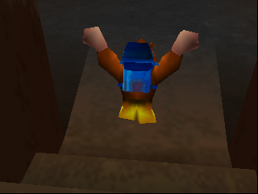

# PIM Pack (Pack Index Manipulation) — Banjo-Tooie research

Root cause, exact trigger conditions, what the corrupted index actually reads and writes,
and tooling to watch it live in BizHawk. Everything below was read out of the game's code
(Banjo-Tooie decomp + disassembly) and then reproduced in an automated emulator harness.

## TL;DR

* The "pointer" that underflows is a **u8 stack index** in Solo Banjo's analog-stick
  component: `BaStick.unk66` at `stick + 0x66`, where `stick = *(PlayerState + 0x128)`.
  The stack it indexes (`stored_zones`) only has **2** entries of 0x1C bytes.
* Pack moves push the current stick "zone" when you enter the pack and pop it when you
  leave. **Snooze Pack and Shack Pack only push part-way into their entry animation**, but
  their talk states still pop on the way out. Interacting (warp pad, sign, NPC) before the
  push happens gives a pop with no push: `0 -> 255`. Each repeat: `255 -> 254 -> ...`.
* After that, every pack entry **writes 28 bytes to `stick + index * 0x1C`** and every pack
  exit **reads 28 bytes back from there into Banjo's stick zone**.
* Verified in emulator: Snooze and Shack underflow, **Sack Pack does not** (its entry
  handler does the missing push itself), Taxi Pack cannot trigger it.

**Follow-up (second round, details in the sections below):**

* **Backflip (Z+A) before the write** resets Banjo's stick thresholds, so the next pack push
  writes a full, known 28 bytes (`pos, id, 0.12, 0.2, 0.5, 0.75, 1.0`) instead of only
  rewriting 8. It also un-freezes the stick after a glitch. → [Backflip](#the-backflip-changes-what-gets-written)
* **Consistency:** the layout after Banjo is repeatable if you **enter the room by the same
  route** and **do the same moves in the room**. Power-on timing doesn't matter (4 cold boots
  with random input delays gave the identical layout). The previous room, heap compaction
  right after loading, and moves that load animations (the backflip itself) do change it.
  → [Consistency](#consistency-what-makes-the-layout-repeatable)
* **Loading zones / credits warp: not reachable with this write.** In all 170 playable rooms
  the loading-zone array sits *before* Banjo's data, and the write only goes forward. No actor
  data (warp pads, doors, NPCs) is ever in range either. → [Loading zones](#loading-zones-and-a-credits-warp)
* **What it can hit:** small Banjo-owned blocks (one is the cached floor triangle →
  **fall through the floor**), loaded assets, and **loaded code** (object overlays like
  `chnests`, `chjinjo`, `chglowbo`). Writing onto a heap block header crashes, and so did
  most writes into overlay code in the tests.
  → [Effects](#effects-found)

## Root cause

All three Solo-Banjo packs share one pair of helpers per pack:

| | Snooze (`bsbansnooze`) | Shack (`bsbanshack`) | Sack (`bsbansack`) |
|---|---|---|---|
| setup (push) | `func_80800098` | `func_8080021C` | `func_808002D4` |
| teardown (pop) | `func_80800000` | `func_80800164` | `func_80800238` |
| state group | `0x14` | `0x13` | `0x12` |

* **setup** = `bastick_pushZone` + set pack zone thresholds, skipped if the *previous*
  state was already in the pack's group.
* **teardown** = `bastick_popZone`, skipped if the *next* state is in the pack's group.

```c
void bastick_popZone(PlayerState *self) {      // core2, 0x8009EF60
    self->stick->unk66--;                        // u8: 0 -> 255
    copy(&self->stick->zone, &self->stick->stored_zones[self->stick->unk66]);
}
void bastick_pushZone(PlayerState *self) {     // core2, 0x8009EFA8
    copy(&self->stick->stored_zones[self->stick->unk66], &self->stick->zone);
    self->stick->unk66++;
}
```

The index is loaded with `lbu` (unsigned), so 255 means `stick + 255*0x1C = stick + 0x1BE4`,
far past the end of the struct.

The entry states don't call setup in their init. They call it from the update function at
a fixed point in the animation and set `PlayerState + 0x15D` (Sack uses `+0x15E`):

| Entry state | push happens at | measured window (game frames after the C-button) |
|---|---|---|
| `0x171` Entering Snooze Pack | 37.0 % of anim `0x276` | B on frames 1–16 works, 20+ is too late |
| `0x16A` Entering Shack Pack | 19.8 % of anim `0x145` | B on frames 1–6 works, 10+ is too late |
| `0x163` Entering Sack Pack | 51.5 % of anim `0x143` | never underflows (see below) |

If something interrupts the entry state before that point, its end handler runs:

* **Snooze / Shack** end handler: `if (+0x15D) teardown(); else backpack_state = 1;`. No
  push. The talk state it goes to (`0x61` / `0x5F`) is in the same group, so its init
  skips the push too. Every state after it (`0x16F` Snoozing / `0x16C` Shack idle) also
  sees a same-group previous state and skips. When you finally leave the pack, the leave
  state's end handler pops: **unbalanced pop, index 0 -> 255**.
* **Sack** end handler: `if (!+0x15E) setup(); teardown();`. It performs the missing push
  before deciding whether to pop, so the stack stays balanced. Tested: index stays 0 at
  every timing.
* **Taxi Pack** (`bstaxi`) pushes in its init, so it can't be interrupted before the push.

Observed state path (emulator, GI Floor 1 warp pad, B pressed 6 frames into Snooze):

```
0x171 Entering Snooze -> 0x61 Snooze talk -> 0x16F Snoozing -> 0x172 Leaving -> 0x01 Idle
index:      0                0                    0                0            255
```

## How to do it

1. Be **Solo Banjo** with **Snooze Pack** (Z + C-Right) or **Shack Pack** (Z + C-Down) learned.
2. Stand where B starts an interaction. A warp pad is easiest. With no other pad unlocked it
   gives the "find another…" text, which still counts. Signs and NPCs should work the same
   way, as long as the interaction puts Banjo into the pack's talk state.
3. Hold Z, press C-Right, then press **B within the window** (Snooze ≈ first 16 game frames,
   Shack ≈ first 6). The animation is cancelled into the talk.
4. Close the text. Banjo drops into the pack (Snoozing / Shack idle). **Leave the pack**:
   that exit pops, and the index is now 255.
5. Repeat steps 3–4 to go to 254, 253, … (verified 255 → 254 → 253 in a row).

What resets it: the index is only zeroed when a PlayerState is created (`bastick_reset`
is only called from the PlayerState constructor), i.e. on map load. Splitting up did
**not** recreate Banjo's PlayerState in testing. So the glitch lives for one map visit.

## What a corrupted index actually does

Every Snooze / Shack / Sack / Taxi entry calls `pushZone`; every exit calls `popZone`.
With index `i` (≥ 2) and slot address `S = stick + i * 0x1C`:

* **pack entry (push):** copies the live zone (`stick + 0x38`, 0x1C bytes) **to `S`**, then `i++`.
* **pack exit (pop):** `i--`, then copies **from `S`** into the live zone.
* **each glitch:** is a pop. It moves the index down one and loads the 28 bytes at the
  new `S` into Banjo's live zone.

The zone is:

```
+0x00 f32 position   (0..1, how far the stick is through the current band)
+0x04 s32 id         (0..4, which stick-magnitude band)
+0x08 f32 markers[5] (band thresholds; default 0.12, 0.2, 0.5, 0.75, 1.0)
```

`id`/`position` are recomputed **every frame** from the analog stick against the current
markers (`bastick_updateZone`). The markers are only changed by states that set them.

That gives two practical write modes:

1. **Glitch, then pack straight away.** The glitch pop loaded `S`'s own bytes into the zone,
   so the push writes the 5 marker words back unchanged. Only **bytes 0–7** at `S` change:
   `position` and `id` from your stick (neutral stick → `00000000 00000000`). Measured in
   emulator: exactly 8 bytes changed.
2. **Glitch, backflip (or walk), then pack.** `bastick_resetZones` makes the zone
   `[pos, id, 0.12, 0.2, 0.5, 0.75, 1.0]` and the push writes all 28 bytes:
   `PPPPPPPP IIIIIIII 3DF5C28F 3E4CCCCD 3F000000 3F400000 3F800000`.
   Walking would do it, but after a glitch you usually *can't* walk (see below). The
   **backflip (Z+A) works without the stick** and does the same reset. Measured, see
   [the backflip section](#the-backflip-changes-what-gets-written).

**Side effect of every glitch:** the 28 bytes it loads become Banjo's stick thresholds.
`bastick_updateZone` only changes the band when the stick falls inside one of the
thresholds, so garbage thresholds can freeze the band. Measured (GI Floor 1, 1 glitch):
the loaded thresholds were tiny denormals, and **Banjo could not walk from idle with the
stick** (moved 0 units vs 684 without the glitch). Jumping still worked. Inside a pack,
movement is normal (pack setup writes its own thresholds), but leaving pops the garbage
back. What you get depends entirely on what the slot contains.

Leaving the pack pops the slot back into the zone, so the write at `S` **stays** in memory.
The game only sees it if something else uses that memory before it's overwritten.

## Where it writes

`S = stick + i * 0x1C`. The PlayerState is one heap block, `0x19C` bytes of component
pointers followed by every component in a fixed order. The stick is component 74 at
`PlayerState + 0xDD0` and the block is `0x1000` bytes. So:

**Map-independent part (i = 2…19): Banjo's own components.** These offsets don't depend on
the map, so they're the most consistent targets, but they need 237–254 glitches.

| i | slot covers | what's there |
|---|---|---|
| 2 | `stick+0x38` | the live zone itself (no-op) |
| 3 | `stick+0x54` | stick values, angle, distance **and the index byte itself** (`+0x66` = marker[2] byte 2). With default markers this sets the byte at `+0x64` to `0x3F`, which disables stick input, and the index becomes 1 again. |
| 4–7 | `ps+0xE40…0xEAF` | `sub` component (+0x04 … +0x58; slot 7 spills into `swim`) |
| 8 | `ps+0xEB0` | component 78 (size from `func_800A06E0`), spills into `timer` |
| 9–13 | `ps+0xECC…0xF57` | `timer` component, last slot spills into `translate` |
| 14 | `ps+0xF58` | `translate` +0x18 |
| 15 | `ps+0xF74` | `van` +0x14 / `wandglow` |
| 16–17 | `ps+0xF90…0xFC7` | `washer` (slot 17 spills into component 84) |
| 18 | `ps+0xFC8` | component 84 |
| 19 | `ps+0xFE4` | `wobble`, ends exactly at the end of the block |

**Map-dependent part (i = 20…255).** Past `ps+0x1000` you're in whatever heap blocks follow
the PlayerState. BT's heap is compacted (defragmented) during play: the PlayerState's
address changed several times in testing, so absolute addresses aren't stable, and what
follows it can change as blocks are allocated and freed. Example, GI Floor 1, Solo Banjo
after the split, one glitch:

| i | heap block after PlayerState |
|---|---|
| 20–25 | 0x90-byte block (referenced from `0x80132E84`) |
| 25–34 | 0xF0-byte block |
| 34–45 | 0x120-byte block owned by Banjo (pointer at PlayerState+0x3D0) |
| 45–77 | a loaded code overlay (`idworld`) |
| 80–255 | one 0x3360-byte loaded asset (from the asset cache at `0x8012B450`) |

So in that run, **every practical glitch count (1–176) hit the same asset block**
(slot `i` is `stick + i*0x1C`; i = 255 is `stick + 0x1BE4`). The second round found that
**GI Floor 1 is a bad room for this**: with other routes it looked completely different
(free memory, a 0x37C0 asset, a 0x13B0 asset) and it keeps changing while you stand still.
See [Consistency](#consistency-what-makes-the-layout-repeatable). Which effects are
reachable is decided by what the room has loaded right after Banjo. `PIM.map()` in the Lua
watcher lists it live.

## The backflip changes what gets written

The push copies Banjo's *live* stick zone, so whatever last set the zone thresholds decides
the payload. Solo Banjo's Z+A "failed flip" (state `0x6C`, `bsbanbflip`) touches them:

```c
case 1: /* flip starts */   bastick_setZoneMax(self, 0, 0.03f); bastick_setZoneMax(self, 1, 1.0f);
case 0: /* end handler */   bastick_resetZones(self);   // 0.12, 0.2, 0.5, 0.75, 1.0
```

So after a backflip lands, the thresholds are the defaults no matter what a glitch loaded.
Measured (GI Floor 1 warp pad, 1 glitch, then the action, then a Snooze Pack push):

| between glitch and pack | 28 bytes written at the slot | can walk afterwards? |
|---|---|---|
| nothing | only bytes 0–7 change (`00000000 00000000`), rest rewritten as-is | no (0 units) |
| try to walk | same as nothing: the stick is frozen, so walk never starts | no |
| **backflip (Z+A)** | `00000000 00000000 3DF5C28F 3E4CCCCD 3F000000 3F400000 3F800000` | **yes** (544 units) |
| backflip, hold stick at 40 during the push | `3ECCCCD0 00000003 …same…` | yes |
| backflip, full tilt during the push | `3F800000 00000004 …same…` | yes |

* The first two words are the zone `position` (0.0–1.0) and `id` (0–4) from the stick at the
  moment of the push. Raw stick 8 is the deadzone edge, about 60 is full. Thresholds are
  0.12/0.2/0.5/0.75/1.0 of full tilt.
* Pack thresholds, for reference: every pack only sets threshold #2 to 1.0
  (`0.12, 1.0, 0.5, 0.75, 1.0`). Leaving the pack pops whatever was pushed, so a pack on its
  own can't leave different thresholds behind. The backflip (and walking/swimming/climbing
  states) can.
* Pack buttons (checked in the emulator): Snooze Z+C-Right, Shack Z+C-Down, Sack Z+C-Up,
  Taxi Z+C-Left. Taxi pushes in its first frame, so it only works as a *writer*.
* **If the write lands on code:** the default payload reads as MIPS
  `nop; nop; lui $s5,0xC28F; lui $t4,0xCCCD; nop; nop; nop`. So it mostly deletes 7
  instructions. `id = 1` (stick just past the deadzone) is a reserved instruction: instant
  crash. Ids 0, 2, 3 and 4 are harmless no-ops. Without the backflip, only the first 2
  instructions become `nop`, and only if the third word isn't a load/store.

## Consistency: what makes the layout repeatable

Everything the glitch reaches is *relative to Banjo's PlayerState*, so what matters is the
order of heap blocks after it, not absolute addresses. Tested by entering 20 rooms after 8
different histories and recording the blocks in range (`t_consist.py`):

* `base`: the GI Floor 1 split state
* `idle`: the same after idling 1500 frames
* `via_F2`: through GI Floor 2 first
* `glitched`: 3 glitches and a pack on Floor 1 first
* `boot_1`–`boot_4`: four **cold boots** with random delays (0–40 frames per menu input,
  0–300 between steps) through new game → GI Floor 1 → split

Findings:

1. **Power-on and input timing don't matter.** All four random cold boots put Banjo's data
   at the same address on GI Floor 1. In **Workers' Quarters all 7 histories that came from
   Floor 1** (including the 4 cold boots, the idle one and the glitched one) gave the
   **identical layout**: 1–3 glitches = keyframe asset, 4 = a heap header, 5–11 = Banjo's
   floor cache, 11–17 = another small block, 17+ = `chnests` code.
2. **The previous room matters a lot.** Code overlays and assets from earlier rooms stay
   loaded. Workers' Quarters entered via Floor 2 had `subaddiefade`, `chloggo`,
   `gspropctrl`, … after Banjo instead of `chnests`. "Same actions" has to include
   **the same route** into the room.
3. **Wait after loading.** The heap is compacted for a while after a room loads. On GI Floor 2
   Banjo's data moved 3 times in the first ~300 frames (`801FBFC0 → 801FBE50 → 801E9070 →
   801E4F50`). Give it ~10 seconds before you start.
4. **Moves that load or free animations move Banjo's data.** The backflip moved the
   PlayerState down by `0x110` in Workers' Quarters (the flip animation was loaded and
   freed, then compaction). Every target shifts with it, relative to the blocks before it.
   Do the same moves in the same order each time, and check with the Lua watcher (it logs
   "PlayerState moved").
5. **Some rooms churn.** GI Floor 1 allocates and frees a 0x1110-byte block on its own while
   you stand still, so its layout changes under you. Rooms that were stable for 2100 frames
   after settling in every history included Workers' Quarters, GI Floor 3, Waste Disposal,
   WW Crazy Castle Stockade and IoH Plateau. CK, CCL Central Cavern and GGM Gloomy Caverns
   looked different after almost every history.
6. **The first Snooze Pack in a room tends to miss the glitch** (the pack's code and animation
   load on first use and shift the timing). Every later attempt hit.
7. **Real glitches vs the index shortcut.** The harness usually sets the index byte directly
   instead of doing k glitches. Checked against **real** glitches at the Workers' Quarters
   signpost (talk to it from its east side) for k = 1, 2, 3, 5, 6, 7, 8. The pushes landed on
   exactly the same addresses, and k = 4 crashed in both. The text boxes themselves don't
   disturb the layout there.

| room (entered from GI F1) | distinct layouts / 8 histories | notes |
|---|---|---|
| GI Workers' Quarters `103` | 2 | all F1 histories identical; only "via F2" differs |
| GI Floor 3 `108` | 2 | `chglowbo` code always first; small blocks after it vary |
| GI Waste Disposal `111` | 4 | `chjinjo` code first in 7/8 |
| IoH Plateau `152` | 5 | `chdoor` code first in 8/8 |
| GI Floor 1 `101` | 6 | churns |
| CK `15D`, CCL `13A`, GGM `0D2` | 6–8 | varied a lot |

## Loading zones and a credits warp

Loading zones are entries in the "object model 2" array (`*0x80132DB0`; layout from
ScriptHawk): 0x14-byte entries, a loading zone has bits 1 and 3 set in `+0x0A`, destination
**map − 0xA0 at `+0x0C`** and **exit at `+0x12`**. (The credits are map `0x19C`, "Roll the
credits".) Redirecting one would mean writing those two fields.

That can't happen with this glitch:

* The write only goes forward from Banjo's stick (`stick + 0x38 … stick + 0x1C00`).
* In **all 170 playable rooms** (`t_scan.py`), the loading-zone array is **before** Banjo's
  PlayerState. The closest is 0x4130 bytes before.
* No actor data (the per-object blocks behind warp pads, doors, NPCs, signs) was in range in
  any room either.
* The map-change variables (`0x80127640` target, `0x80127642` trigger) are fixed addresses
  in the game's static data, nowhere near the heap.

What *is* in range is listed in [Effects found](#effects-found) below. The closest thing to a
"different loading zone" is overwriting a door's or switch's code (`chdoor` on IoH Plateau,
`chdrawbridgeswitches` in CK). The payload is too fixed to choose a destination with, so
expect crashes rather than warps.

## Effects found

Method (`run_effect.sh`):

1. Solo Banjo in the room (entered from GI Floor 1, heap settled).
2. Set the index for k glitches.
3. Do the backflip (B) or skip it (A), then a Snooze Pack push and leave the pack.
4. Run a fixed walk/jump.
5. Compare against a control run with the same inputs and a normal index.

The Workers' Quarters slots were also checked with real signpost glitches (see
Consistency). Outcomes:

* **crash**: the game stopped.
* **falls through the floor**: Banjo ends in a falling state below the floor.
* **stuck stick**: Banjo can't walk afterwards (the pop loaded garbage thresholds).
* **nothing visible**: no difference vs control in position, state, objects, items or flags.

**Workers' Quarters `103`**, backflip payload:

| glitches | lands in | result |
|---|---|---|
| 1–3 | keyframe asset (`asset 0000`) | nothing visible |
| 4 | the next block's **heap header** | crash |
| 5, 7 | Banjo's floor cache | stuck stick |
| **6** | Banjo's floor cache (+0x68, the floor triangle) | **falls through the floor** (screenshot below) |
| 8–9 | Banjo's floor cache | nothing visible (9: one unnamed counter word differs) |
| 10–17 | the 0xA0 block before it (holds model pointers) and its header | crash |
| 18, 23–30 | `chnests` overlay, its data tables at the end | nothing visible in the test |
| 19–22 | `chnests` | crash |

Without the backflip (payload A), the same room gives stuck stick for every non-crashing
count from 1 to 11, and crashes at 4, 10 and 12–17.

**GI Floor 3 `108`**, backflip payload: 1–3 stuck stick (a 0x120 block); 4–5 nothing
visible; 6 crash; 7–14 and 16–18 nothing visible; 15, 19, 20, 22, 23 crash; 21 stuck stick;
24–30 `chglowbo` data, nothing visible.

**GI Waste Disposal `111`**, backflip payload: 1–6 Banjo ends ~120 units from the control
run, or stuck stick at 5 (a 0x120 block; 6 = its heap header, no crash in the test window);
7, 15, 16, 29 crash; 8–14 stuck stick or nothing; 17–28 keyframe asset (stuck stick or
nothing); **30 falls through the floor**.



(The test build regenerated all textures, hence the colours.)

Patterns that should carry over to other rooms:

* **Heap headers** sit every block boundary. Writing onto one crashes the next time the
  heap is walked. `PIM.map()` shows where the boundaries are.
* **Banjo's floor cache** (`*(PlayerState+0x6AC)`, 0xA0 bytes) is often 5–15 glitches away.
  The right slot makes him fall through the floor. Other slots just freeze the stick.
* **Loaded code** (`chnests`, `chglowbo`, `chjinjo`, `chdoor`, …) usually starts 17–30
  glitches away. Its tail is data tables; deeper in is code, where the payload deletes
  instructions. What that does depends on the function. The tests here only walked and
  jumped, so effects that need interacting with that object (a nest, a Glowbo) wouldn't
  show up.
* No warp destination and none of the 24 named item counters changed in any test. Flag
  and unnamed-counter differences only showed up in runs where Banjo couldn't walk (or fell)
  and so didn't trigger what the control run triggered.

## Practical notes

## Practical notes

* Consistency recipe: same route into the room, wait ~10 s, then the same moves in the same
  order (including the first, usually failed, Snooze attempt). Check with `PIM.map()`
  before committing to a long setup. Details in
  [Consistency](#consistency-what-makes-the-layout-repeatable).
* Rough cost per step: one pack start, B, close text, leave pack. Low indices (own
  components) are a long grind; high indices (1–20 glitches) are cheap and map-dependent.
* Any pack that pushes can be the "writer" once the index is corrupted: Snooze, Shack, Sack
  and Taxi Pack. Only Snooze and Shack can *create* the underflow.
* A pack exit right after a push restores the zone, so moving in and out of a pack is safe.
  Each **glitch** is what changes the zone.

## Caveats

* Testing used the decomp-matching build of **USA 1.0** (code and overlays byte-identical
  to retail, assets regenerated). Code paths, timings and struct offsets are retail-exact.
  Exact heap addresses depend on asset sizes, which should match but need checking on a
  retail ROM: that's what the Lua watcher is for.
* Frame windows are in **game frames** (one per rendered frame), not BizHawk VI frames.
  BT usually renders at 20–30 fps, so expect roughly 2–3 VIs per game frame.
* PAL/JP addresses in the Lua script come from ScriptHawk and are untested. The block labels
  (`PIM.map()`, asset/code names) only work on USA.
* The test build is the public "clean room" build: game code compiled from the
  matching decomp (identical to retail), but every texture and sound regenerated. Code
  overlays are byte-identical to retail, so their sizes match. Asset sizes can differ, so
  rooms where an *asset* sits after Banjo may be laid out differently on a retail ROM.
* Effects were checked in mupen64plus, which doesn't emulate the CPU caches. On a console,
  a write onto code only takes effect once the data cache line is written back and the
  instruction cache drops the old line. That usually happens within frames, but timing can
  differ from emulators.
* Rooms outside GI were entered by warping a GI split state into them. Their real layout
  depends on that world's own rooms (point 2 of Consistency), so treat those rows as
  examples only.

## Tools in this repo

* `lua/pim_pack_watch.lua`: BizHawk overlay. Shows the state, the zone index, whether the
  entry window is open, the next push target (which component or heap block), the bytes
  there and the bytes that will be written. Logs every index change and every time Banjo's
  PlayerState moves. Target blocks are labelled: code overlay name, asset id, "Banjo floor
  cache", "loading-zone array". From the Lua console, `PIM.setIndex(n)` jumps to an index
  for practice, and **`PIM.map()` prints every block in range with the glitch counts that
  land in it**. Use this to check a room/route on your own setup.
* `harness/`: the headless mupen64plus driver used for the tests (frame-stepped Python
  scripts with RAM access and pad input). Needs `libmupen64plus2`, `mupen64plus-rsp-hle`,
  your own ROM (`BT_ROM=...`), a ScriptHawk checkout (`SCRIPTHAWK_BT_LUA=.../games/bt.lua`)
  and optionally the decomp (`BT_DECOMP=...`) for symbol names. Build the two plugins with
  `gcc -shared -fPIC -O2 -fvisibility=hidden -o input_ctl.so input_ctl.c` (same for
  `video_null.c`).
  * `make_base.py` boots a new file and saves Spiral Mountain and GI Floor 1 states (fixed
    menu input sequence; `boot_to_sm(emu, jitter)` adds delays).
  * `make_solo2.py` splits up on the GI Floor 1 split pads.
  * `make_boot.py SEED`: power-on with random input delays → GI Floor 1 → split, saves
    `states/boot_SEED.st` (the "reset the console" histories).
  * `make_room.py MAP`: warp the split state into a room, let the heap settle, save it.
  * `t_pad.py` puts Solo Banjo on the warp pad.
  * `t_glitch.py Z+CR 2 6 10 …` sweeps the B timing.
  * `t_write.py N` does N glitches plus a push and diffs RAM.
  * `t_heapmap.py <state>` prints the index → heap block map.
  * `t_payload.py none flip walk flip:0,40 …` shows what the push writes after each action.
  * `t_scan.py out.json MAP… | all` records what's in range in each room (plus loading-zone
    array position, split pads, objects). Results for 170 rooms are summarised above.
  * `t_consist.py MAP [HISTORY…]` compares the layout after different histories.
  * `t_effect.py` / `run_effect.sh ROOMSTATE OUT A|B LO HI`: one write per slot, then a fixed
    walk/jump, compared against a control run that does the same inputs without the
    corrupted index. Crashes are recorded and the run resumes.
  * `t_real.py SPOT A|B K…` does K **real** glitches at a text spot, to check the shortcut.
  * `t_probe.py ROOMSTATE A|B IDX [rice]`: detailed diff (objects, items, flags) and
    screenshots for one write.
  * `t_stickmap.py` measures raw stick → stick value.
  * `om2.py` (loading-zone array), `dllmap.py` (overlay address → decomp function).
  * The emulator run aborts after 30–40 s without frames, which is how game crashes show up
    in mupen64plus.
  * Screenshots (`t_probe.py … rice`) need `mupen64plus-video-rice` and an X display
    (e.g. `Xvfb :99`, `DISPLAY=:99`, `SHOTS=dir`). Everything else runs with the null video
    plugin.

## Key addresses (USA)

| what | address / offset |
|---|---|
| player pointers / index | `0x80135490[ *(u8*)0x801354DF ]` |
| PlayerState → state `{prev,cur,next}` | `+0x120` |
| PlayerState → stick | `+0x128` (component 74) |
| PlayerState → transformation | `*(+0xA0) + 0x29` (10 = Solo Banjo) |
| Snooze/Shack entry "pushed" flag | `PlayerState + 0x15D` |
| stick zone (pushed data) / stack index | `stick + 0x38` (0x1C bytes) / `stick + 0x66` (u8) |
| `bastick_popZone` / `bastick_pushZone` | `0x8009EF60` / `0x8009EFA8` |
| state → group table | `0x80117F30` (12-byte entries, group at +2) |
| ability flags | flag `0xED + ability` (Snooze 0x23, Shack 0x21, Sack 0x2A, Taxi 0x27, Split Up 0x0E) |
| loading-zone (object model 2) array | `*0x80132DB0`: u16 entry size, u16 count+1, entries; LZ = bits 1,3 of `+0x0A`; map−0xA0 `+0x0C`; exit `+0x12` |
| map change target / trigger | `0x80127640` / `0x80127642` (static) |
| asset cache | pointers `0x8012B450[0x82]`, ids `0x8012B6E0[0x82]`, refcounts `0x8012B658` |
| loaded code overlays | `0x80126738[]` (name string after the header pointers) |
| Banjo floor cache | `*(PlayerState + 0x6AC)` (component 37), 0xA0 bytes |
| game frame counter | `0x8012AAE0` (u32) |
| backflip state / overlay | `0x6C` / `bsbanbflip` (`setZoneMax(0,0.03)`, `(1,1.0)` on start; `resetZones` on end) |
